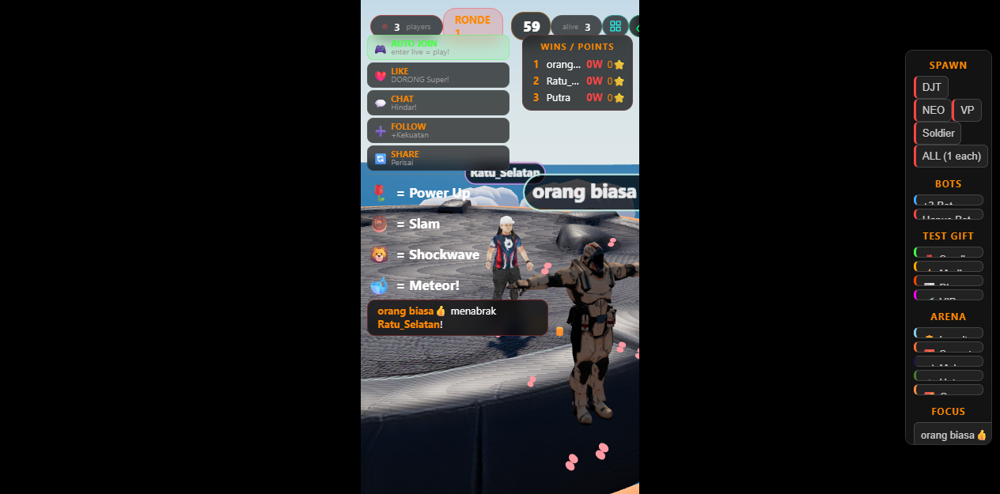

# 🥊 Battle Ring — TikTok Live Arena Battle

Game pertarungan 3D real-time untuk TikTok Live. Viewer menjadi karakter dan bertarung di arena. Gift, like, chat, dan follow dari viewer memicu efek visual di game.

**✅ Tested: 67+ ronde tanpa lag/hang, stabil 3+ jam live**



## ✨ Fitur Utama

### 🎮 Gameplay
- **Karakter 3D** — DJT, NEO, VP, Soldier (GLB models dengan 14 animasi)
- **Arena Dinamis** — 5 tema (Langit Biru, Sunset, Malam, Hutan, Gurun)
- **Auto Camera** — 5 mode kamera (dramatic, orbit, follow, cinematic, low_orbit)
- **Round System** — WAITING → COUNTDOWN → ACTIVE → ENDED → INTERMISSION

### 🎁 Gift System
| Gift Tier | Nama | Efek |
|-----------|------|------|
| 🌹 Small (1-10💎) | Power Up | Heart burst + kekuatan 2x lipat |
| ⚡ Medium (11-99💎) | Ground Slam | Energy ball + shockwave + knockback |
| 🌪️ Big (100-499💎) | Shockwave Slam | Tornado + petir + AoE knockback kuat |
| ☄️ VIP (500+💎) | Meteor Spin | Meteor jatuh + nuke semua pemain |

### 🤖 Bot System
- **Auto-start** — Bot spawn otomatis dalam 5 detik jika tidak ada viewer
- **Auto-fill** — Jika kurang dari 3 pemain, bot langsung spawn
- **130+ nama Indonesia** — Budi, Andi, Sari, Rizky, Sultan_Battle, dll
- **Karakter random** — DJT, NEO, VP, atau Soldier
- **Auto-respawn** — Jika semua bot mati, spawn bot baru (max 5× per round)

### 🎤 TTS Banter System
- **220+ dialog** dalam 23 kategori (sapaan, taunt, humor, motivasi, CTA, dll)
- **Anti-repeat** — History tracking 20 dialog terakhir
- **Category cooldown** — Kategori sama tidak muncul 2x berturut
- **Context-aware** — Dialog menyesuaikan HP, arena, durasi live
- **Chat bubble** — Dialog muncul di atas kepala karakter (unggu)
- **Dual voice** — Male (Microsoft Andika) + Female (Google Bahasa Indonesia)

### 📊 Dashboard
- **Auto-Connect** — Checkbox untuk auto-connect ke TikTok saat server start
- **Sessions Debug** — Panel untuk monitor active sessions
- **Viewer Limit** — Max 20 viewer card, sisanya "+X lainnya"
- **Live Feed** — Real-time chat, gift, follow, like events

## 🚀 Instalasi

```bash
# Clone repository
git clone https://github.com/kiozhu/battle-ring.git
cd battle-ring

# Install dependencies
npm install

# Buat file .env
cp .env.example .env
```

### Konfigurasi `.env`

```env
PORT=5051
TIKTOK_USERNAME=username_tiktok_kamu
EULER_API_KEY=kunci_api_euler_kamu
AUTO_CONNECT=true
```

### Jalankan

```bash
# Development (auto-restart)
npm run dev

# Production
npm start

# Dengan PM2
pm2 start server.js --name battle-ring
```

## 🎮 Cara Pakai

### 1. Buka Game
```
http://localhost:5051/sumo
```

### 2. Hubungkan ke TikTok Live
- Klik tombol 🔗 **Connect TikTok** di pojok kanan atas
- Masukkan username TikTok yang sedang live
- Klik **Connect**

Atau langsung via URL:
```
http://localhost:5051/sumo?room=username_tiktok
```

### 3. Interaksi Viewer
| Aksi Viewer | Efek di Game |
|-------------|--------------|
| Join | Karakter masuk arena |
| Chat | Chat bubble di atas karakter |
| Like | Efek hati, push musuh |
| Gift kecil | Power Up |
| Gift sedang | Ground Slam |
| Gift besar | Shockwave Slam |
| Gift VIP | Meteor Spin |
| Follow | Efek bintang |

### 4. Dashboard
```
http://localhost:5051
```
- Monitor viewers, chat, gift, likes
- Copy URL untuk Battle Ring dan Overlay
- Toggle Auto-Connect
- Debug sessions

### 5. OBS Overlay
```
http://localhost:5051/overlay
```
- Tambahkan sebagai Browser Source di OBS
- Ukuran: 1080x1920 (portrait) atau sesuaikan

## 🏗️ Arsitektur

```
TikTok Live → tiktok-live-connector → Node.js Server → Socket.IO → Browser (Three.js)
```

### Komponen Utama

| Komponen | Teknologi | Fungsi |
|----------|-----------|--------|
| Server | Node.js + Express | HTTP server, API endpoints |
| Real-time | Socket.IO | Komunikasi server ↔ browser |
| 3D Engine | Three.js | Render karakter, arena, efek |
| TikTok | tiktok-live-connector | Koneksi ke TikTok Live |
| TTS | Web Speech API | Suara announcer + banter |

### Struktur File

```
├── server.js              # Server utama (Express + Socket.IO)
├── public/
│   ├── battle-ring.html   # Game client (Three.js)
│   ├── index.html         # Dashboard
│   ├── overlay.html       # OBS overlay
│   └── assets/
│       ├── base.glb       # Model arena
│       └── characters/
│           ├── DJT/       # Karakter DJT
│           ├── NEO/       # Karakter NEO
│           ├── VP/        # Karakter VP
│           └── Soldier/   # Karakter Soldier
├── .env                   # Konfigurasi
└── package.json           # Dependencies
```

## 🛡️ Stabilitas

### Fitur Anti-Crash

| Fitur | Fungsi |
|-------|--------|
| Token Bucket Rate Limiting | Batasi events per tipe (prevent overwhelming browser) |
| Three.js Memory Dispose | Bersihkan GPU memory otomatis (prevent memory leak) |
| Cap Viewers Map | Batasi 2000 viewers per session (prevent OOM) |
| Ocean Optimization | Update gelombang tiap 3 frame (hemat CPU 66%) |
| Cache Alive Players | 0 array allocations per detik (hilangkan micro-stutter) |
| Exponential Backoff | Reconnect otomatis 2s→4s→8s→16s→30s (max 5 attempts) |
| Graceful Shutdown | Bersih saat SIGINT/SIGTERM |
| Banter Anti-Overlap | isSpeaking flag + safety timeout 15 detik |

### Rate Limits

| Event | Burst | Sustain | Drop? |
|-------|-------|---------|-------|
| member | 8 | 4/detik | Ya |
| chat | 20 | 12/detik | Ya |
| like | 4 | 2/detik | Ya |
| gift | 30 | 15/detik | **Tidak** |
| follow | 10 | 5/detik | Ya |
| share | 6 | 3/detik | Ya |

## 🎨 Arena Themes

| Tema | Warna |
|------|-------|
| Langit Biru | Biru muda, laut biru |
| Sunset | Ungu-pink, laut gelap |
| Malam Hari | Biru tua, laut hitam |
| Hutan | Hijau, laut hijau tua |
| Gurun | Oranye, laut coklat |

## 🔧 API Endpoints

| Method | Endpoint | Fungsi |
|--------|----------|--------|
| GET | `/sumo` | Game client (Battle Ring) |
| GET | `/` | Dashboard |
| GET | `/overlay` | OBS overlay |
| POST | `/api/connect` | Hubungkan ke TikTok Live |
| GET | `/api/config` | Konfigurasi server |
| GET | `/api/auto-connect` | Status auto-connect |
| POST | `/api/auto-connect` | Toggle auto-connect |
| GET | `/api/sessions` | List active sessions |
| GET | `/api/session/:room/cost` | Estimasi biaya session |
| GET | `/api/proxy-image` | Proxy gambar TikTok |
| POST | `/api/voice/generate` | Generate TTS commentary |
| POST | `/api/chat/send` | Kirim chat ke TikTok |

## 📦 Dependencies

| Package | Versi | Fungsi |
|---------|-------|--------|
| express | ^5.2.1 | HTTP server |
| socket.io | ^4.8.3 | Real-time communication |
| tiktok-live-connector | ^2.1.1-beta1 | TikTok Live connection |
| dotenv | ^16.4.7 | Environment variables |

## 🐛 Troubleshooting

### Game tidak bisa connect ke TikTok
- Pastikan `EULER_API_KEY` di `.env` sudah benar
- Pastikan username TikTok sedang live
- Cek server logs: `pm2 logs battle-ring`

### Game lag/stutter
- Pastikan browser tidak banyak tab
- Cek FPS di Chrome DevTools → Performance
- Kurangi jumlah bot jika terlalu banyak

### Server crash
- Cek logs: `pm2 logs battle-ring --lines 50`
- Restart: `pm2 restart battle-ring`

### TTS tidak bunyi
- Klik halaman sekali (browser block audio tanpa user interaction)
- Cek console log: `[BanterTTS] Male: ... | Female: ...`

## 📄 License

MIT

## 🙏 Credits

- [tiktok-live-connector](https://github.com/zerodytrash/TikTok-Live-Connector) — TikTok Live connection library
- [Three.js](https://threejs.org/) — 3D rendering engine
- [KayKit](https://kaylousberg.itch.io/) — Character models (DJT, NEO, VP)
